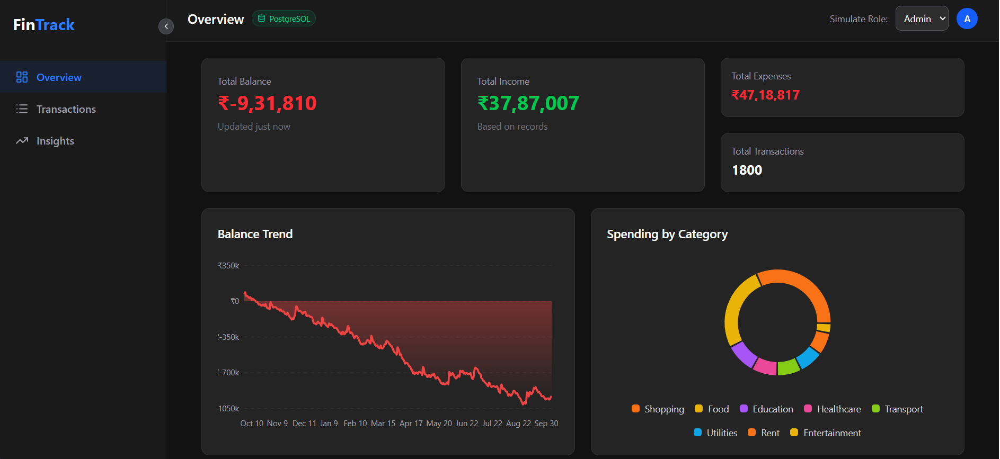
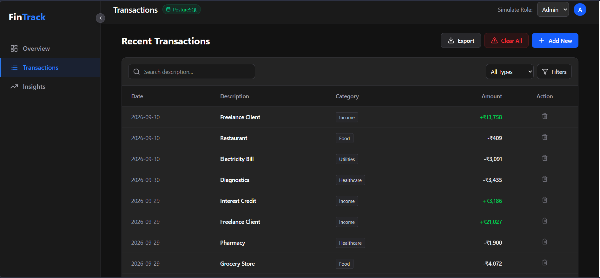
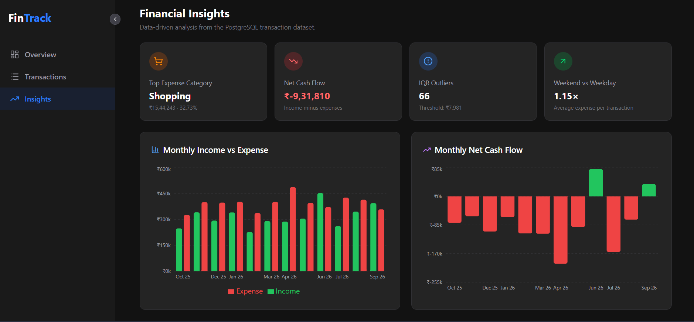

# 📈 FinTrack — Finance Dashboard UI

A modern, responsive, and interactive finance dashboard built with **React**, **Vite**, and **Tailwind CSS**. Developed as a frontend evaluation assignment to demonstrate UI/UX design, component architecture, and state management.

---

## 📸 Screenshots

### Overview


### Transactions


### Insights


---

## 🚀 Live Features

### 1. Dashboard Overview
- **Dynamic Summary Cards** — Total Balance, Income, and Expenses calculated in real-time from transaction history
- **Balance Trend (Area Chart)** — Chronological interactive chart showing running balance over time, with a custom tooltip that surfaces specific transactions per day
- **Spending Breakdown (Donut Chart)** — Groups expenses by category and visualizes them sorted from highest to lowest

### 2. Transactions Management
- **Full CRUD** — Add new transactions (Income/Expense) and delete existing ones
- **Smart Search** — Real-time filtering by transaction description
- **Advanced Filtering & Sorting** — Filter by type (Income/Expense), category, and date range; sort by Date or Amount
- **Graceful Empty States** — Custom UI fallbacks for empty filter results and an entirely empty transaction history

### 3. Role-Based UI (RBAC Simulation)
- Toggle between **Admin** and **Viewer** roles via a dropdown
- **Viewers** can analyze data and use all filters, but add/delete/clear actions are hidden
- **Admins** have full control over the transaction list

### 4. Insights
- **Highest Spending Category** — Dynamically computed with its percentage of total expenses
- **System Observation** — Automated analysis of the income-to-expense ratio with tailored advice (e.g., deficit warning if spending exceeds income)

---

## 🌟 Optional Enhancements

| Feature | Details |
|---|---|
| Dark Mode | Designed natively with a premium dark-theme aesthetic using Tailwind |
| Data Persistence | `localStorage` keeps transactions intact across page refreshes |
| Export Functionality | Export the current filtered view as `.CSV` or `.JSON` |
| Micro-interactions | Hover transitions, collapsible sidebar, slide-in animations |

---

## 🛠️ Tech Stack

| Layer | Choice | Reason |
|---|---|---|
| Framework | React 18 + Vite | Fast dev server, modern bundling |
| Styling | Tailwind CSS | Utility-first, responsive by default |
| Charts | Recharts | Declarative React components, smooth animations |
| Icons | Lucide React | Consistent, lightweight icon set |
| State | `useState` + `useMemo` | Sufficient for this scope; no external library needed |

---

## 🧠 State Management Approach

State is **lifted to `App.jsx`** — the transaction array is the single source of truth shared across Overview, Transactions, and Insights tabs.

All derived data (chart groupings, category totals, monthly summaries) is computed using `useMemo` to avoid redundant recalculations on every render. Filters, search query, sort preferences, and the active role are all stored as top-level state and passed down as props.

---

## 💻 Local Setup

### Prerequisites
Make sure [Node.js](https://nodejs.org/) is installed on your machine.

### Steps

```bash
# 1. Clone the repository
git clone https://github.com/ak-jaat-007/Fintrack.git
cd fintrack

# 2. Install dependencies
npm install

# 3. Start the development server
npm run dev
```

Then open your browser at:
```
http://localhost:5173
```

---

## 📂 Project Structure

```
src/
├── components/
│   ├── Overview.jsx       # Summary cards and charts
│   ├── Transactions.jsx   # Data table, filters, search, export
│   ├── Insights.jsx       # Financial observations and analysis
│   └── Sidebar.jsx        # Collapsible navigation
├── data.js                # Initial mock/fallback transaction data
├── App.jsx                # Root layout and top-level state
├── index.css              # Tailwind base imports
└── main.jsx               # React entry point
```

---

## 📝 Assumptions & Design Decisions

- **No backend required** — `localStorage` acts as a lightweight simulated database for persistence
- The "Add Transaction" flow uses a clean modal/form component for a production-like feel
- All financial figures are computed client-side from the transaction array — no hardcoded summary values
- The RBAC toggle is intentionally simple (frontend-only) as the brief specified no backend auth

---

## 📊 Assignment Criteria Coverage

| Criteria | Implementation |
|---|---|
| Design & Creativity | Dark-theme dashboard with area/donut charts and polished card layout |
| Responsiveness | Tailwind responsive utilities; collapsible sidebar on smaller screens |
| Functionality | Full CRUD, search, filter, sort, role switching |
| User Experience | Empty states, real-time updates, smooth transitions |
| Technical Quality | Component-based architecture, memoized derived state, clean file structure |
| State Management | Lifted state in `App.jsx`, `useMemo` for derived data, `localStorage` for persistence |
| Documentation | This README |
| Attention to Detail | Role-gated actions, export formats, graceful edge case handling |